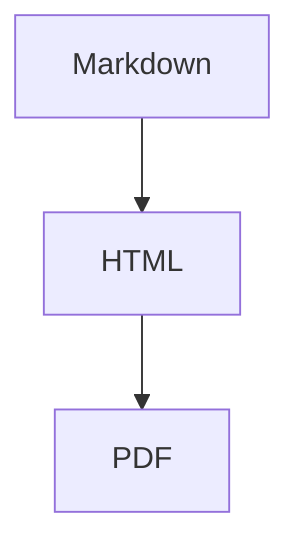

# **MdPdf**

**MdPdf** is a .NET 10 command-line application that converts Markdown into a single-page PDF using GitHub-style rendering, Mermaid diagram support, and a locally resolved browser engine.

It is designed for two use cases:

- End users who want a simple installed CLI for turning Markdown into polished PDFs.
- Contributors who want a small, testable codebase with a clear split between CLI orchestration and rendering logic.

## Features

- Converts Markdown files or raw Markdown strings to PDF.
- Uses GitHub-style Markdown rendering.
- Supports Mermaid diagrams in fenced code blocks.
- Supports GitHub alert blocks such as `NOTE`, `TIP`, `WARNING`, and `CAUTION`.
- Supports explicit `--light` and `--dark` theme selection.
- Resolves an installed browser instead of downloading Chromium at runtime.
- Supports browser-path persistence in a JSON config file under the user config directory.
- Caches stylesheet and Mermaid assets into a per-user application data folder for reuse and customization.
- Includes automated tests for parser, config, browser resolution, and HTML generation behavior.

## Supported Platforms

**MdPdf** is distributed as an installed CLI for:

- Windows
- Linux

The rendering engine depends on an existing compatible browser installation. Install Google Chrome, Microsoft Edge, or Chromium before running **MdPdf**. The app will try to resolve a local browser executable automatically, or it can use a configured browser path.

## Installation

### Windows

Install or update the Windows build with the installer script:

```powershell
irm https://raw.githubusercontent.com/maffaciolli/MdPdf/master/scripts/install.ps1 | iex
```

Pin a specific version:

```powershell
& ([scriptblock]::Create((irm https://raw.githubusercontent.com/maffaciolli/MdPdf/master/scripts/install.ps1))) -Version 1.2.3
```

This installs:

- app files in `%LocalAppData%\Programs\MdPdf\current`
- the `mdpdf` shim in `%LocalAppData%\Programs\MdPdf\bin\mdpdf.cmd`
- config in `%LocalAppData%\MdPdf\MdPdf.config.json`

### Linux

Install or update the Linux build with the installer script:

```bash
curl -fsSL https://raw.githubusercontent.com/maffaciolli/MdPdf/master/scripts/install.sh | sh
```

Pin a specific version:

```bash
curl -fsSL https://raw.githubusercontent.com/maffaciolli/MdPdf/master/scripts/install.sh | VERSION=1.2.3 sh
```

This installs:

- app files in `$HOME/.local/share/mdpdf/current`
- the `mdpdf` symlink in `$HOME/.local/bin/mdpdf`
- config in `${XDG_CONFIG_HOME:-$HOME/.config}/mdpdf/MdPdf.config.json`

## Quick Start

Convert a Markdown file and let **MdPdf** infer the output path:

```bash
mdpdf ./document.md
```

This produces `document.pdf` beside the source file.

Convert a Markdown file and choose the output path:

```bash
mdpdf ./document.md ./output/report.pdf
```

Render raw Markdown instead of reading a file:

```bash
mdpdf "# Hello World"
```

Force light mode:

```bash
mdpdf ./document.md --light
```

Force dark mode explicitly:

```bash
mdpdf ./document.md --dark
```

## Command-Line Reference

Usage:

```text
mdpdf <markdown-file-or-string> [output-path] [--dark|--light] [--browser-path <path>] [--save-browser-path]
```

Arguments:

- `<markdown-file-or-string>`
  - Either a path to a Markdown file or a raw Markdown string.
- `[output-path]`
  - Optional output PDF path.
  - If omitted and the input is a file, the output defaults to the same path with a `.pdf` extension.
  - If omitted and the input is a raw string, the output defaults to `output.pdf` in the current directory.

Flags:

- `--dark`
  - Renders using the dark GitHub-style theme.
  - This is already the default.
- `--light`
  - Renders using the light GitHub-style theme.
- `--browser-path <path>`
  - Uses the specified browser executable path.
- `--save-browser-path`
  - Persists the resolved browser path to `MdPdf.config.json`.

## Browser Resolution

**MdPdf** does not download Chromium during normal execution. Instead, it resolves an installed browser executable in this order:

1. `--browser-path` from the CLI
2. `browserPath` from `MdPdf.config.json`
3. OS-specific browser discovery

Current browser discovery behavior:

- Windows
  - Attempts to inspect the default browser association for `http` or `https`
  - Falls back to common Chrome, Edge, and Chromium install paths
- Linux
  - Attempts to inspect the default browser desktop entry
  - Resolves the desktop entry `Exec=` command
  - Falls back to common Chrome and Chromium install paths
- macOS
  - Falls back to common application bundle executable paths

If a browser path is explicitly configured but the executable does not exist, **MdPdf** throws an error instead of silently ignoring it.

## Configuration

**MdPdf** stores the persisted browser path in `MdPdf.config.json` at these locations:

- Windows: `%LocalAppData%\MdPdf\MdPdf.config.json`
- Linux: `${XDG_CONFIG_HOME:-$HOME/.config}/mdpdf/MdPdf.config.json`

Example:

```json
{
  "browserPath": "C:\\Program Files\\Google\\Chrome\\Application\\chrome.exe"
}
```

The config file is optional. If it does not exist, **MdPdf** falls back to CLI arguments and automatic browser discovery.
When you pass `--save-browser-path`, **MdPdf** writes the resolved browser executable path into this config file for future runs.

## Assets And Customization

**MdPdf** stores runtime assets in a per-user application data `Assets` folder.

Files used by the renderer:

- `Assets/github-markdown-light.min.css`
- `Assets/github-markdown-dark.min.css`
- `Assets/mermaid.min.js`

Default locations:

- Windows: `%LocalAppData%\MdPdf\Assets`
- Linux: `${XDG_DATA_HOME:-$HOME/.local/share}/mdpdf/Assets`
- macOS: `~/Library/Application Support/MdPdf/Assets`

Behavior:

- If an asset is already present, **MdPdf** reuses it.
- If an asset is missing, **MdPdf** downloads it from the configured CDN source and saves it locally.

## Rendering Behavior

**MdPdf** renders Markdown to HTML with [Markdig](https://github.com/xoofx/markdig), then loads that HTML in a headless browser through [PuppeteerSharp](https://github.com/hardkoded/puppeteer-sharp) to produce a single-page PDF.

Current rendering details:

- GitHub-style HTML layout
- Mermaid diagrams rendered in-page before PDF generation
- GitHub alert block styling with tinted backgrounds
- Page padding applied via generated CSS
- PDF sized to content height to avoid hard page breaks
- Background printing enabled

Example supported Mermaid block:

````md

````

Example supported GitHub alert:

```md
> [!TIP]
> Use `--save-browser-path` after verifying the correct browser path.
```

## Project Structure

```text
src/
  MdPdf.Console/
    Program.cs
  MdPdf.Library/
    BrowserConfig.cs
    BrowserPathResolver.cs
    CommandLineParser.cs
    MarkdownToPdfConverter.cs

tests/
  MdPdf.Console.Tests/
```

Responsibilities:

- `MdPdf.Console`
  - CLI entrypoint
  - argument handling
  - config loading and saving
  - file input handling
- `MdPdf.Library`
  - parser logic
  - browser resolution
  - config serialization
  - HTML generation and PDF rendering
- `MdPdf.Console.Tests`
  - unit coverage for parser, config, browser resolution, and converter behavior

## Building From Source

Prerequisites:

- .NET 10 SDK
- A compatible installed browser. Install Google Chrome, Microsoft Edge, or Chromium before running the app.

Restore:

```bash
dotnet restore
```

Build:

```bash
dotnet build MdPdf.slnx
```

Run the CLI from source:

```bash
dotnet run --project src/MdPdf.Console -- ./README.md
```

## Testing

Run the test suite:

```bash
dotnet test tests/MdPdf.Console.Tests/MdPdf.Console.Tests.csproj
```

The current test suite covers:

- command-line parsing
- browser config loading and saving
- browser executable resolution
- generated HTML behavior
- asset caching behavior
- Mermaid script inlining and escaping
- GitHub alert CSS regression coverage

## Formatting

The repository uses CSharpier through MSBuild.

Relevant files:

- [Directory.Build.props](/c:/Users/mathe/source/repos/MdPdf/Directory.Build.props)
- [Directory.Packages.props](/c:/Users/mathe/source/repos/MdPdf/Directory.Packages.props)
- [.csharpierignore](/c:/Users/mathe/source/repos/MdPdf/.csharpierignore)

Minified CSS files are excluded from formatting through `.csharpierignore`.

## Dependencies

Primary runtime dependencies:

- [Markdig](https://github.com/xoofx/markdig)
- [PuppeteerSharp](https://github.com/hardkoded/puppeteer-sharp)

Package versions are managed centrally in [Directory.Packages.props](/c:/Users/mathe/source/repos/MdPdf/Directory.Packages.props).

## Troubleshooting

### No browser found

If **MdPdf** cannot find a browser automatically:

1. Pass `--browser-path` explicitly.
2. Re-run with `--save-browser-path` to persist it.
3. Verify that the configured executable exists and is runnable.

### Output theme is wrong

Dark mode is the default. If you want light output, pass:

```bash
mdpdf ./document.md --light
```

### Raw Markdown produced `output.pdf`

That is expected. When the input is a raw string and no explicit output path is given, **MdPdf** writes to `output.pdf` in the current working directory.

## Development Notes

Some current implementation choices are deliberate:

- Browser download is avoided in favor of installed browser resolution.
- Rendering defaults to dark mode.
- HTML and I/O paths are asynchronous where it matters.
- Tests follow `Must_..._when_...` naming, Shouldly assertions, and explicit `Arrange / Act / Assert` structure.

## License

This project is licensed under the [MIT License](LICENSE).
